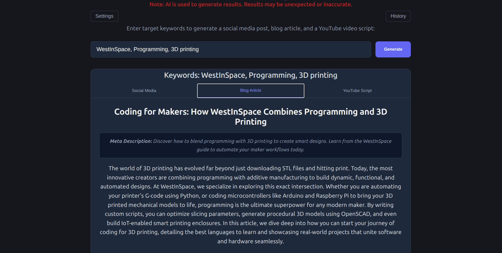
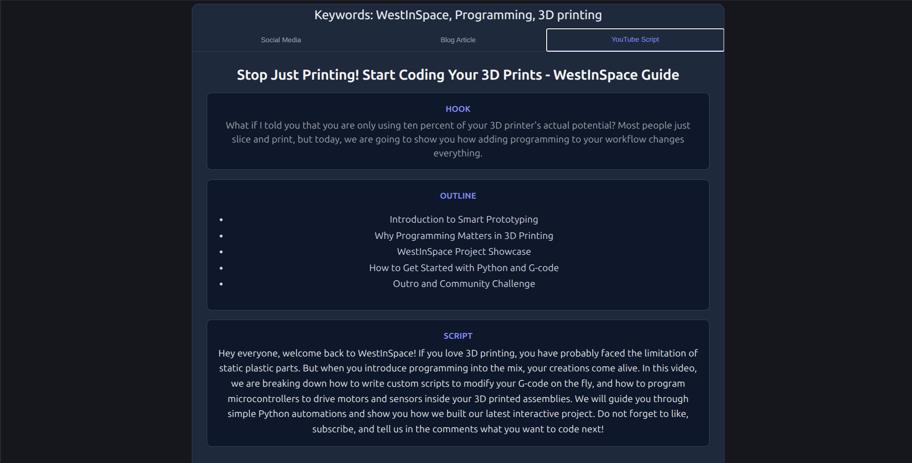
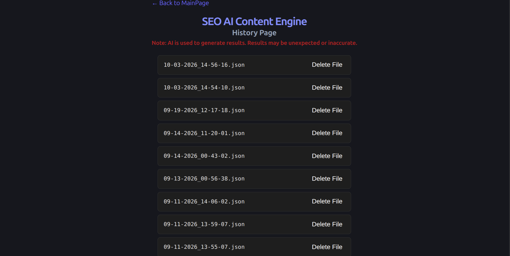
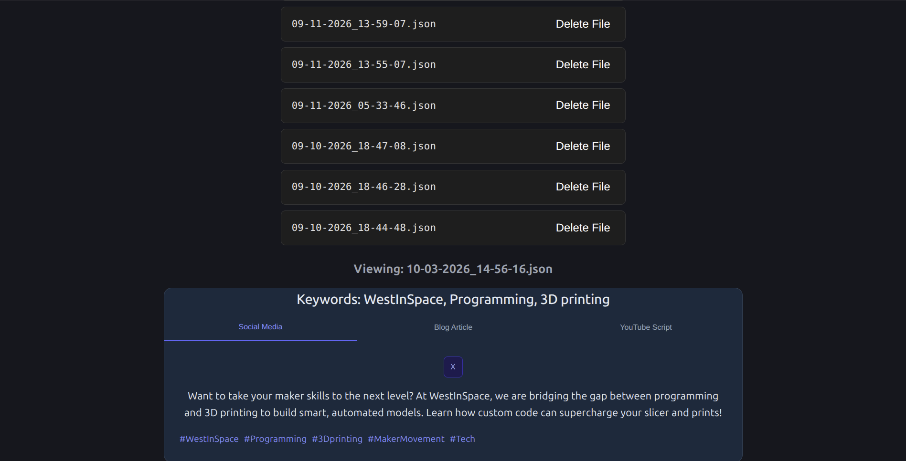

# AI SEO Content Engine
---
An AI powered social media seo optimized content generator.
---

## Application Features

- An AI powered application  
- Give the application some SEO Keywords related to the post you would like to make and click generate to be given a Social Media Post, a blog article, and a YouTube script  
- View and manage all generated content history. See past Social media posts, blog articles, and video scripts for each set of keywords entered.  
- Cross platform support for both Linux and Windows, and hopefully soon Mac.  

## Description

This is a project to take in existing SEO keywords obtained from another source and utilizes the Google Gemini api to use those keywords to create a blog article, a social media post, and a video script.

The target audiance of this program is small bussinesses, so that they may easily create content to build brand reputation and recognition.

The goal of this project is not to give full ready to post online content, but rather to give the user a great clean starting point to build the content themselves and give that ever so difficult to capture human asspect.

*Note: This application uses AI to generate responses. By the nature of AI responses may be unreliable or incorrect. This application is not intended to replace human review. I reccommend viewing and modifying AI responses to add that human element back into them and confirm correctness.*

---

**Project Screenshots**

Image of generated socail media post with keywords: WestInSpace, Programming, 3D printing  

Image of generated Blog Post with keywords: WestInSpace, Programming, 3D printing  

Image of generated Video Script with keywords: WestInSpace, Programming, 3D printing  

Image of generated content history page  

Image of viewing history item: 10-03-2026_14-56-16 with keywords: WestInSpace, Programming, 3D Printing  

---

**Video Demo of Project**

---

## Tech stack

### Frontend
- **Frameword:** React v19.2.8
- **State/Routing:** React-dom v19.2.8, React-Router-dom v7.18.3
- **Programming Languages:** JavaScript
- **Styling language:** CSS

### Backend
- **Runtime:** Node.js v24.17.0
- **Framework:** Express v5.2.1
- **Programming Languages:** JavaScript

### Deployment and Testing
- **Applictaion:** electron v44.2.0
- **Builder:** electron-builder v26.15.3
- **Build Automation:** Makefile

---

## Development/build details

# See the documentation directory for more detailed docs for development and building

**Testing the application in the browser**  
- To start the backend and frontend server run: `make start`  
- Once both the backend and frontend servers are runngng you can view the application on localhost at:  
`http://localhost:3000`  
- To see health check for the Google Gemini API endpoint see:  
`http://localhost:5000/api/gemini`  
- To check the history endpoint visit:  
`http://localhost:5000/api/history`  
- To stop the backend and frontend server run: `make stop`  

**Testing the application in Electron**  
- Make sure that the application is not running so ports 5000 and 3000 are free by running: `make stop`  
- In the project root run: `make testElectron`  
- A window will pop up with the application running in electron for testing.  
- After testing close the window and make sure that the application is fully stopped by running: `make stop`  

**Building the application in Electron for deployment**  
- Make sure that the application is not running so ports 5000 and 3000 are free by running: `make stop`  
- Build the application for your OS by running: `make build`  
- Find the built .appimage, .exe or .dmg files in /dist/  
- If your OS is not correctly detected see the Makefile.md docs to build for your OS specifically.  

---

## Known issues / planned improvments

- When viewing the history the entries are displayed by their date generated (the name of their file). In the future I would like to display descriptive text for the name of each entry and allow the user to search for entries.

- I would like to add a feature where the user can download a history file and then share it with someone else and then that person could upload that history file and view it and store it in their own application.

---

